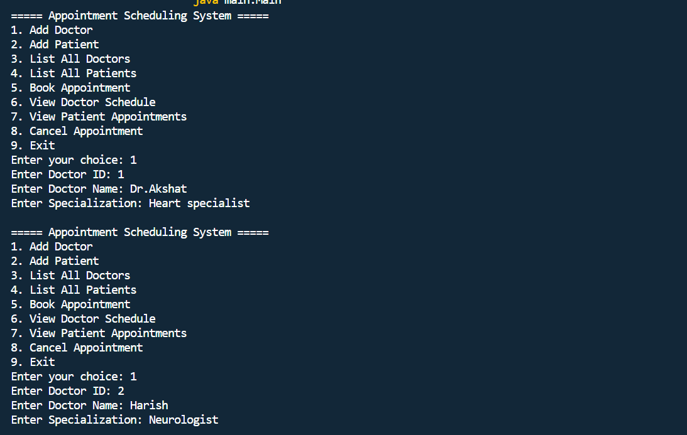
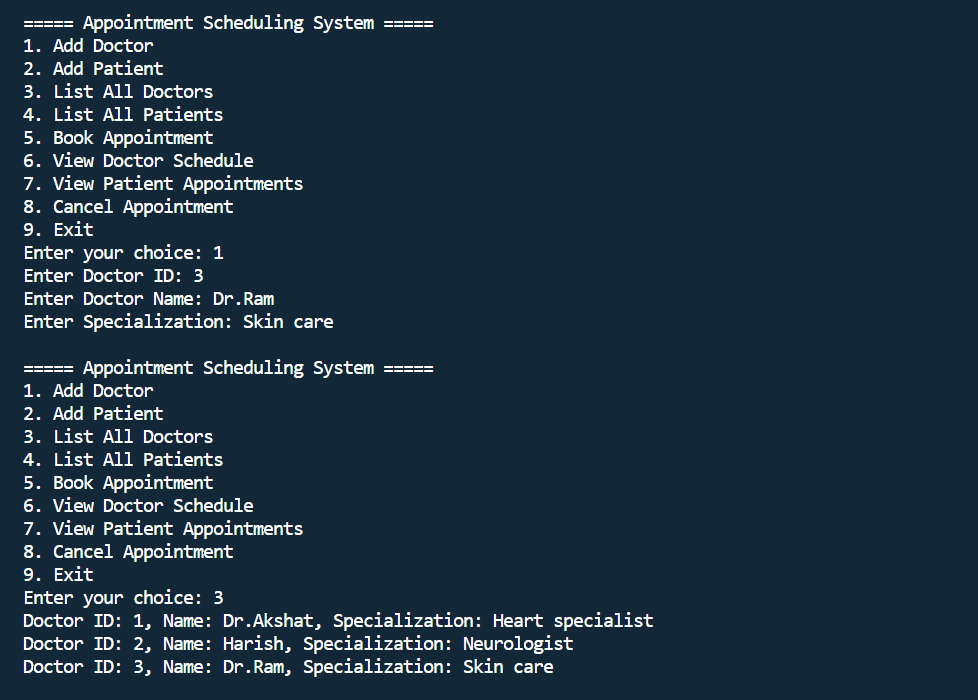
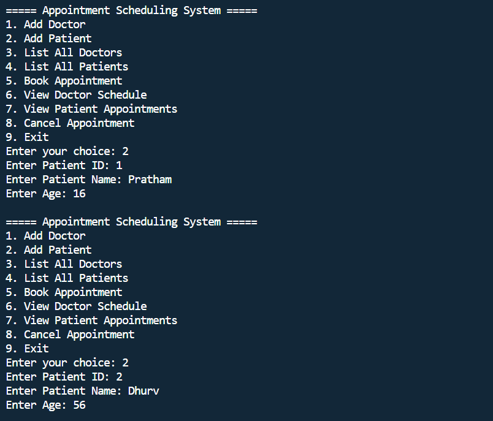
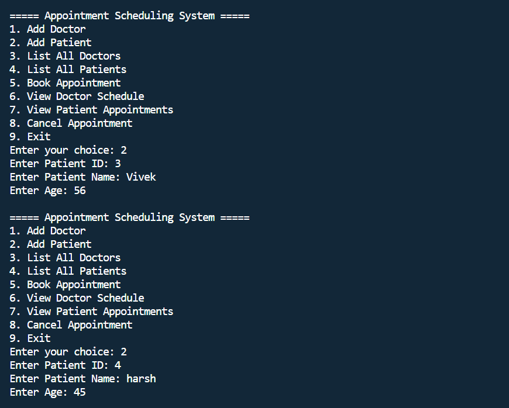
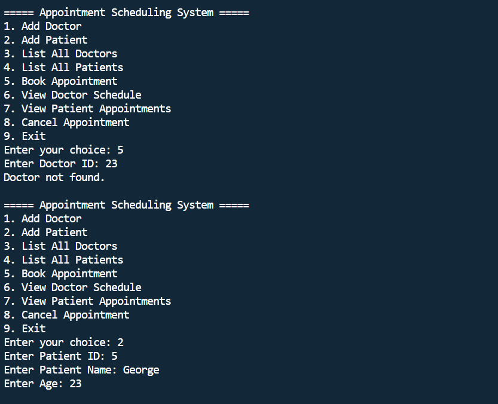
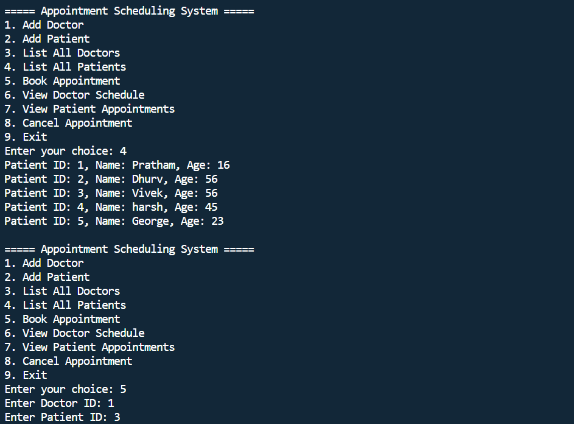
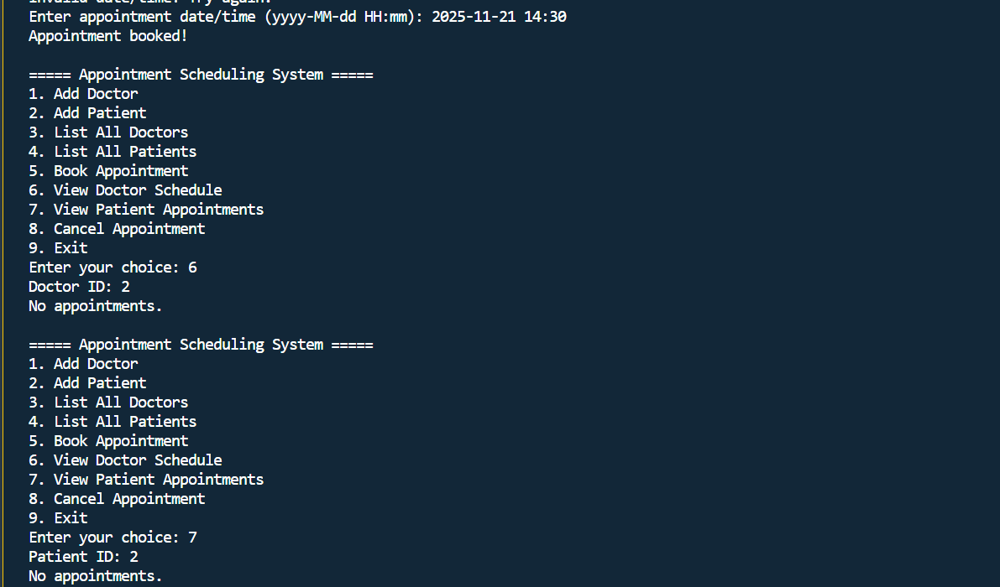
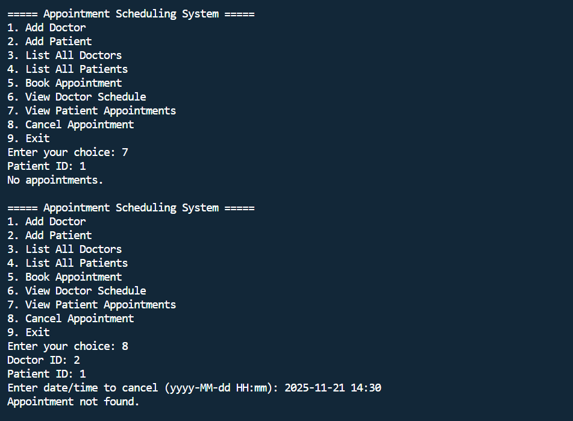
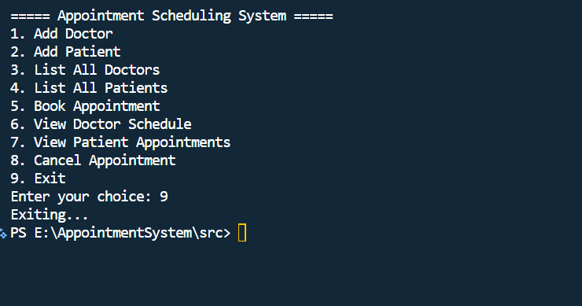

# Appointment Scheduling System (Healthcare Domain)

##  Project Title
**Appointment Scheduling System**

## Overview of the Project
The Appointment Scheduling System is a Java-based console application designed to simplify the process of managing doctor–patient appointments.  
It enables healthcare clinics to maintain records of doctors, patients, and appointments efficiently.  
The system ensures smooth scheduling while preventing double bookings and offering clear visibility into patient and doctor schedules.

This project demonstrates key Object-Oriented Programming concepts such as classes, objects, packages, encapsulation, and modular design using Java.


##  Features
- Add new doctors to the system  
- Add new patients  
- Book appointments with date & time  
- View all registered doctors  
- View all registered patients  
- View a doctor’s appointment schedule  
- View a patient’s appointment history  
- Cancel an existing appointment  
- Prevents double-booking for the same doctor and time  


## 🛠 Technologies / Tools Used
- **Java 17+**  
- **VS Code** (Code Editor)  
- **Git & GitHub** (Version Control)  
- **UML diagrams** (Design Support)  
- **Command Line (Terminal)** for compiling and running the project


## Steps to Install & Run the Project

### 1. Clone the Repository
```bash
git clone https://github.com/parth06-tech/Appointment-Scheduling-System-Java
cd AppointmentSystem/src


2. Compile the Project

Make sure you are inside the src folder.

javac -d . main/Main.java models/*.java services/*.java utils/*.java


3. Run the Project
java main.Main


🧪 Instructions for Testing

1. Start the application

2. Add 1–2 doctors

3. Add 1–2 patients

4. Book an appointment using correct date format:

yyyy-MM-dd HH:mm


5. View doctor schedule

6. View patient appointments

7. Try booking the same doctor at the same time → system should show conflict

8. Cancel an appointment and verify it's removed

9. Exit application


📸 Screenshots











